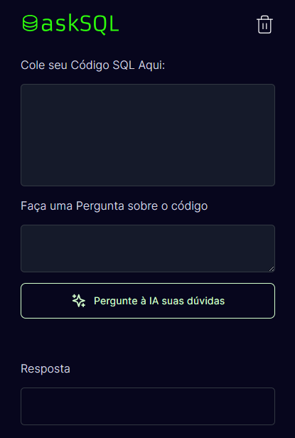

# BoraCodar 32

O Bora Codar é um desafio exclusivo e gratuito, promovido pela Rocketseat para ensino de tecnologias WEB.  

> Desafio do BoraCodar

## 🚀 Tecnologias

Esse projeto foi desenvolvido com as seguintes tecnologias:

- HTML, CSS, JavaScript 
- Git e Github

## 💻 Projeto Bora Codar 34

O Bora Codar 32 é uma IA de perguntas em SQL

## 🔖 Layout

Você pode visualizar o layout do projeto através [DESSE LINK](https://www.figma.com/community/file/1271110680628406853/app-de-traducao-de-sql-com-ia-desafio-32). É necessário ter conta no [Figma](https://figma.com) para acessá-lo.

## :memo: Licença

Esse projeto está sob a licença MIT.