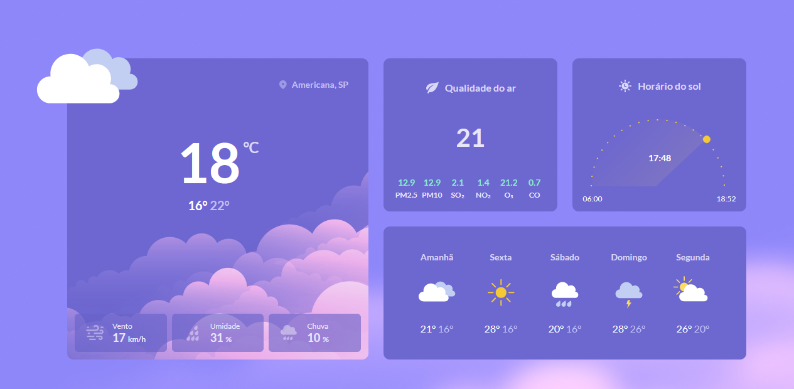

# BoraCodar 10

O Bora Codar é um desafio exclusivo e gratuito, promovido pela Rocketseat para ensino de tecnologias WEB.  

> Desafio do BoraCodar

## 🚀 Tecnologias

Esse projeto foi desenvolvido com as seguintes tecnologias:

- HTML e CSS 
- Git e Github 
- Figma

## 💻 Projeto Bora Codar 10

O Bora Codar 10 é uma página de tempo, qualidade do ar, horário do sol. 

## 🔖 Layout

Você pode visualizar o layout do projeto através [DESSE LINK](https://www.figma.com/community/file/1215291914714743267). É necessário ter conta no [Figma](https://figma.com) para acessá-lo.

## :memo: Licença

Esse projeto está sob a licença MIT.
