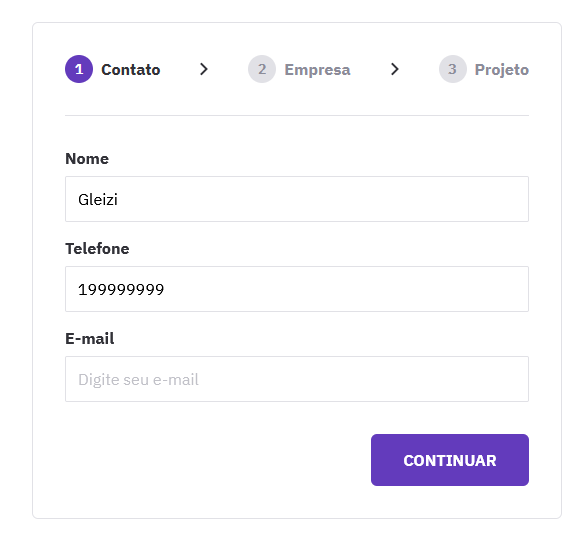

# BoraCodar 23

O Bora Codar é um desafio exclusivo e gratuito, promovido pela Rocketseat para ensino de tecnologias WEB.  

> Desafio do BoraCodar

## 🚀 Tecnologias

Esse projeto foi desenvolvido com as seguintes tecnologias:

- HTML, CSS e JS
- Git e Github 
- Figma

## 💻 Projeto Bora Codar 23

O Bora Codar 23 é uma página de formulários.

## 🔖 Layout

Você pode visualizar o layout do projeto através [DESSE LINK](https://www.figma.com/file/cHupXravMEe7IXKfkeFUBL/Formul%C3%A1rio-Multi-Step--%E2%80%A2-Desafio-23-(Community)?type=design&mode=design&t=KcQsRWI4r73AyGhl-0). É necessário ter conta no [Figma](https://figma.com) para acessá-lo.

## :memo: Licença

Esse projeto está sob a licença MIT.
