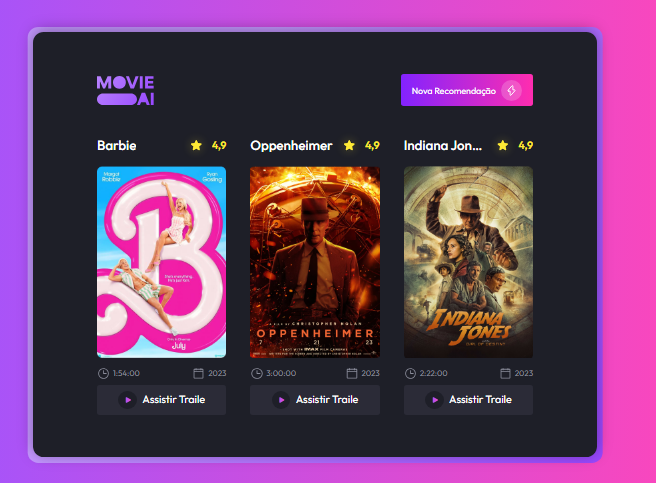

# BoraCodar 30

O Bora Codar é um desafio exclusivo e gratuito, promovido pela Rocketseat para ensino de tecnologias WEB.  

> Desafio do BoraCodar

## 🚀 Tecnologias

Esse projeto foi desenvolvido com as seguintes tecnologias:

- HTML, CSS, JavaScript e API
- Git e Github
- Figma

## 💻 Projeto Bora Codar 30

O Bora Codar 30 é uma página de sugestões de filmes.

## API - TMDB

você pode acessar a API atrasvés [DESSE LINK](https://developer.themoviedb.org/docs)

## 🔖 Layout

Você pode visualizar o layout do projeto através [DESSE LINK](https://www.figma.com/community/file/1266028958590001589). É necessário ter conta no [Figma](https://figma.com) para acessá-lo.

## :memo: Licença

Esse projeto está sob a licença MIT.
